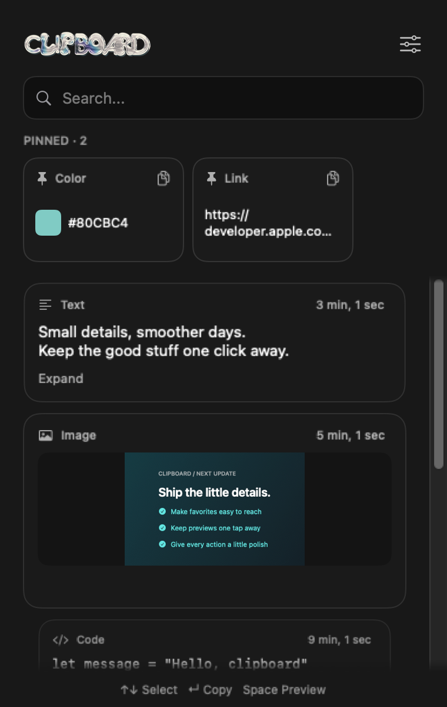
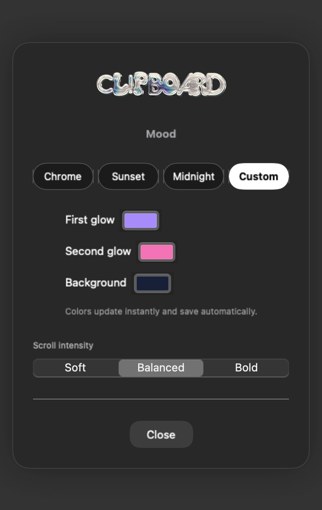
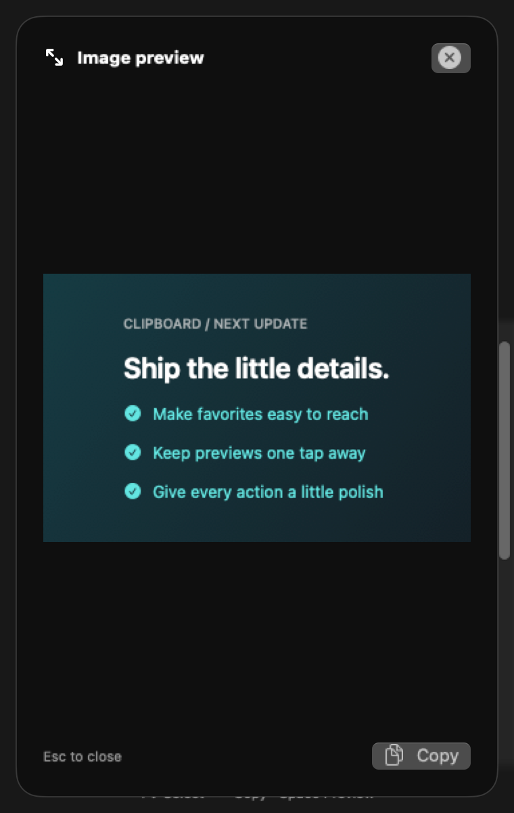

# ClipBoard

A native macOS menu bar clipboard manager built with SwiftUI and AppKit. Keep copied text and images close, pin favorites, and browse your history with the keyboard.

## Screenshots

These screenshots use sample content rendered from the app’s SwiftUI views.

<table>
  <tr>
    <td align="center"><strong>Clipboard history</strong></td>
    <td align="center"><strong>Custom Mood</strong></td>
    <td align="center"><strong>Image preview</strong></td>
  </tr>
  <tr>
    <td></td>
    <td></td>
    <td></td>
  </tr>
</table>

## Features

- Text and image history saved between launches, with up to 50 unpinned entries.
- A separate pinned shelf for favorites, with pins saved between launches.
- Search, readable full-width cards, timestamps, and hover actions.
- Click text to copy; click images to open an animated preview with a separate Copy button.
- Expand long text or open its full preview.
- Link domains, monospace formatting for detected code, and hex color swatches.
- Delete with a six-second Undo option.
- Animated card entrances, hover effects, copy feedback, and scrolling stacks.
- Chrome, Sunset, Midnight, and Custom moods. Custom colors save automatically.
- Soft, Balanced, and Bold scroll intensity, with support for macOS Reduce Motion.

## Keyboard controls

| Shortcut | Action |
| --- | --- |
| Control + C | Open or close the menu bar popover |
| ↑ / ↓ | Select an item, including pinned favorites |
| Enter | Copy the selected item |
| Space | Preview the selected item |
| Esc | Close the preview or settings; clear an active search |
| Command + Z | Undo the most recent deletion while Undo is available |

Typing in Search keeps the normal text-editing behavior. Press ↓ to move from Search into the cards.

## Build and run

Requires **macOS 14.0 or later**. Verified with **Xcode 16.2** on an Intel Mac running macOS 14.8.4.

1. Clone the repository to a writable directory on your Mac.
2. Open `ClipBoard.xcodeproj` in Xcode.
3. Let Swift Package Manager resolve [HotKey](https://github.com/soffes/HotKey).
4. Select **My Mac**, then press **Command + R**.
5. Open ClipBoard from its menu bar icon or press **Control + C**.

The app runs in the menu bar and has no Dock window. History stays local in the user’s Application Support directory.
